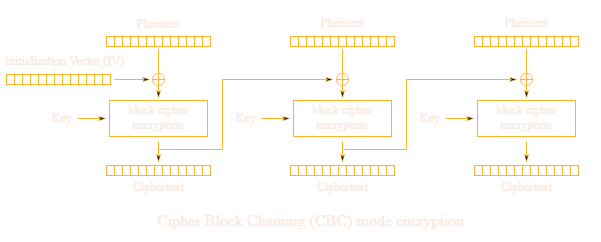

# AES CBC decryptato con ECB

In una challenge in cui è possibile encryptare in modalità CBC, ma decryptare solo con ECB e l'IV è conosciuto, possiamo fare manualmente i passaggi che mancano ad ECB per diventare CBC.

## AES ECB

AES ECB funziona così:


## AES CBC

AES CBC funziona in questo modo, aggiunge lo xor dei blocchi con i precedenti e del primo con l'IV:



## Esempio di challenge:

```python
from Crypto.Cipher import AES

KEY = ?
FLAG = ?

@chal.route('/ecbcbcwtf/decrypt/<ciphertext>/')
def decrypt(ciphertext):
    ciphertext = bytes.fromhex(ciphertext)

    cipher = AES.new(KEY, AES.MODE_ECB)
    try:
        decrypted = cipher.decrypt(ciphertext)
    except ValueError as e:
        return {"error": str(e)}

    return {"plaintext": decrypted.hex()}

@chal.route('/ecbcbcwtf/encrypt_flag/')
def encrypt_flag():
    iv = os.urandom(16)

    cipher = AES.new(KEY, AES.MODE_CBC, iv)
    encrypted = cipher.encrypt(FLAG.encode())
    ciphertext = iv.hex() + encrypted.hex()

    return {"ciphertext": ciphertext}
```

### Soluzione:

```python
from requests import get
from pwn import xor

ciphertext = get('https://aes.cryptohack.org/ecbcbcwtf/encrypt_flag/').json().get('ciphertext')
ciphertext_blocks = [ciphertext[i: i+32] for i in range(0, len(ciphertext), 32)]

iv = ciphertext_blocks[0]
ciphertext_blocks = ciphertext_blocks[1:]

plaintext = get('https://aes.cryptohack.org/ecbcbcwtf/decrypt/' + ''.join(ciphertext_blocks)).json().get('plaintext')
plaintext_blocks = [bytes.fromhex(plaintext[i: i+32]) for i in range(0, len(plaintext), 32)]

print(xor(plaintext_blocks[0], bytes.fromhex(iv)).decode() + xor(bytes.fromhex(ciphertext_blocks[0]), plaintext_blocks[1]).decode())
