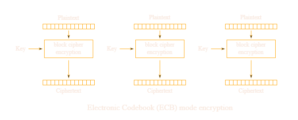

# ECB Oracle

Un ECB Oracle mette a disposizione una funzione di encrypt e aggiunge la flag al nostro input, come mostrato nel seguente codice:

```python
from Crypto.Cipher import AES
from Crypto.Util.Padding import pad, unpad

KEY = ?
FLAG = ?

def encrypt(plaintext):
    plaintext = bytes.fromhex(plaintext)

    padded = pad(plaintext + FLAG.encode(), 16)
    cipher = AES.new(KEY, AES.MODE_ECB)
    try:
        encrypted = cipher.encrypt(padded)
    except ValueError as e:
        return {"error": str(e)}

    return {"ciphertext": encrypted.hex()}
```



Queste challenge si basano sul fatto che, in ECB, un blocco con un certo contenuto sarà trasformato sempre nello stesso output, a differenza di CBC in cui anche i blocchi precedenti hanno degli effetti sull'output di un blocco.

Per poter trovare la flag è necessario "spingerla" in un blocco di cui conosciamo il contenuto. Il blocco migliore (almeno in questo caso) è l'ultimo, se riusciamo a paddare la flag in modo tale da arrivare a una situazione di questo tipo: `'input + padding' 'caratteri della flag' 'padding'`.

A questo punto "spingiamo" la flag avanti byte per byte e, dato che sappiamo che l'unico byte di differenza tra il blocco con il nostro input e quello finale è il singolo byte della flag, possiamo trovare ogni volta il byte appena spinto tramite brute force:

1. `'X + padding' 'padding + altri caratteri della flag' 'X + padding'`
2. `'Y + X + padding' 'padding + altri caratteri della flag' 'Y + X + padding'`
3. ...

Quando l'encrypt del blocco con il nostro input sarà uguale a quello del blocco finale, allora sappiamo che abbiamo trovato un carattere della flag. Ovviamente, per trovare tutti i caratteri, vanno considerati gli spostamenti del blocco contenente l'output che ci interessa.

> **Nota**: È importante considerare che la funzione `pad` con parametro 16, se riceve un input di 16 byte, restituisce 2 blocchi da 16: uno uguale all'input e un altro composto solo da byte `\x10` (padding).

## Soluzione

La soluzione dell'esempio è la seguente:

```python
from Crypto.Util.Padding import pad
from requests import get

url = "https://aes.cryptohack.org/ecb_oracle/encrypt/"

found_text = ""
flag_len = 25  # Trovata perché dopo aver mandato in input 7 byte si aggiunge un nuovo blocco, quindi 32 - 7 = 25

for i in range(1, 26):
    for c in range(128):
        if not chr(c).isprintable():
            continue
        
        payload = pad((chr(c) + found_text).encode(), 16).hex() + '00' * (7 + i)
    
        res = get(f'{url}{payload}').json().get('ciphertext')
        blocks = [res[j:j+32] for j in range(0, len(res), 32)]
        
        # print(chr(c), blocks, payload, len(payload))
        
        if blocks[0] == blocks[-((len(found_text) + 1) // 16 + 1)]:
            found_text = chr(c) + found_text
            print(f'Found: {found_text}')
            break
```
