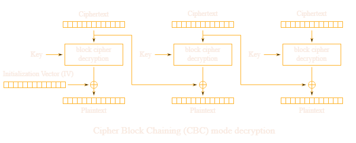

# AES CBC con IV a scelta

Nelle challenge in cui è possibile scegliere l'IV con cui verrà decryptato il ciphertext è possibile sfruttare la tecnica 'Bit flipping'.
Il bit flipping consiste nello sfruttare il fatto che l'IV viene xorato con il primo blocco di plaintext, calcolando un IV tale che quando verrà xorato con il primo blocco modificherà il contenuto del plaintext.




## Dimostrazione

C = primo blocco
F = plaintext che si vuole ottenere

C ⊻ IV = plaintext

C ⊻ (IV ⊻ F) = plaintext ⊻ F

C ⊻ (IV ⊻ F ⊻ plaintext) = F

## Esempio di challenge

```python
from Crypto.Cipher import AES
import os
from Crypto.Util.Padding import pad, unpad
from datetime import datetime, timedelta


KEY = ?
FLAG = ?


@chal.route('/flipping_cookie/check_admin/<cookie>/<iv>/')
def check_admin(cookie, iv):
    cookie = bytes.fromhex(cookie)
    iv = bytes.fromhex(iv)

    try:
        cipher = AES.new(KEY, AES.MODE_CBC, iv)
        decrypted = cipher.decrypt(cookie)
        unpadded = unpad(decrypted, 16)
    except ValueError as e:
        return {"error": str(e)}

    if b"admin=True" in unpadded.split(b";"):
        return {"flag": FLAG}
    else:
        return {"error": "Only admin can read the flag"}


@chal.route('/flipping_cookie/get_cookie/')
def get_cookie():
    expires_at = (datetime.today() + timedelta(days=1)).strftime("%s")
    cookie = f"admin=False;expiry={expires_at}".encode()

    iv = os.urandom(16)
    padded = pad(cookie, 16)
    cipher = AES.new(KEY, AES.MODE_CBC, iv)
    encrypted = cipher.encrypt(padded)
    ciphertext = iv.hex() + encrypted.hex()

    return {"cookie": ciphertext}
```

### Soluzione

```python
from requests import get
from pwn import xor

ciphertext = get('https://aes.cryptohack.org/flipping_cookie/get_cookie/').json().get('cookie')
ciphertext_blocks = [ciphertext[i: i+32] for i in range(0, len(ciphertext), 32)]

iv = ciphertext_blocks[0]
ciphertext_blocks = ciphertext_blocks[1:]

cookie_content = "admin=False;expi".encode()
new_iv = xor(bytes.fromhex(iv), "\x00\x00\x00\x00\x00\x00False\x00\x00\x00\x00\x00".encode(), "\x00\x00\x00\x00\x00\x00True;\x00\x00\x00\x00\x00".encode()).hex()

# C ⊻ IV = plaintext
# plaintext = '...False...'
# C ⊻ IV ⊻ '\x00True;\x00' = '...False...' ⊻ '\x00True;\x00'
# C ⊻ IV ⊻ '\x00True;\x00' ⊻ '\x00False\x00' = '...True;...'

print(get(f'https://aes.cryptohack.org/flipping_cookie/check_admin/{''.join(ciphertext_blocks)}/{new_iv}').json().get('flag'))
```