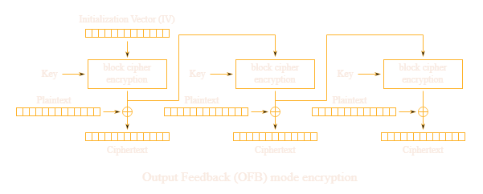

# AES OFB con plaintext a scelta

La modalità OFB (ma anche CTR o CFB) di AES è uno STREAM cipher, quindi è possibile encryptare plaintext di lunghezza non multipla di BLOCK_LENGTH perché lo stream generato a partire dalla chiave viene xorato con il plaintext, come una sorta di OTP generata tramite la chiave.



Analizziamo questo servizio in cui è possibile encryptare qualsiasi plaintext e ottenere la flag encryptata.

```python
from Crypto.Cipher import AES

KEY = ?
FLAG = ?

@chal.route('/symmetry/encrypt/<plaintext>/<iv>/')
def encrypt(plaintext, iv):
    plaintext = bytes.fromhex(plaintext)
    iv = bytes.fromhex(iv)
    if len(iv) != 16:
        return {"error": "IV length must be 16"}

    cipher = AES.new(KEY, AES.MODE_OFB, iv)
    encrypted = cipher.encrypt(plaintext)
    ciphertext = encrypted.hex()

    return {"ciphertext": ciphertext}

@chal.route('/symmetry/encrypt_flag/')
def encrypt_flag():
    iv = os.urandom(16)

    cipher = AES.new(KEY, AES.MODE_OFB, iv)
    encrypted = cipher.encrypt(FLAG.encode())
    ciphertext = iv.hex() + encrypted.hex()

    return {"ciphertext": ciphertext}
```

Dato che possiamo inviare qualsiasi plaintext, mandiamo solo byte 0, in questo modo l'operazione STREAM ⊻ CIPHERTEXT diventerà STREAM ⊻ 0 e avrà come risultato STREAM.
Conoscendo lo stream è quindi possibile xorare la flag encryptata con quest'ultimo e ottenere la flag in chiaro.

```python
from requests import get
from pwn import xor

BLOCK_SIZE = 16

res = bytes.fromhex(get('https://aes.cryptohack.org/symmetry/encrypt_flag/').json().get('ciphertext'))
blocks = [res[i: i+BLOCK_SIZE] for i in range(0, len(res), BLOCK_SIZE)]

iv = blocks[0].hex()
ciphertext = b''.join(blocks[1:])

print(f'{iv=}', f'{ciphertext=}')

# mandando solo byte 0 l'operazione STREAM ⊻ CIPHERTEXT = STREAM, quindi otteniamo lo stream e possiamo decifrare il ciphertext originale (contenente la flag) con lo XOR
null_plaintext = (b'\x00'*(len(ciphertext))).hex()
res = get(f'https://aes.cryptohack.org/symmetry/encrypt/{null_plaintext}/{iv}/').json().get('ciphertext')

stream = bytes.fromhex(res)
print(f'{stream=}') 

plaintext = xor(stream, ciphertext).decode()
print(f'{plaintext=}')
```

