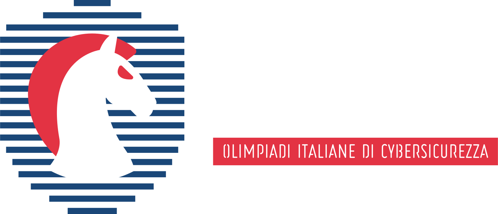

# Olicyber
This repository is a collection of writeups and solutions for various Capture The Flag (CTF) challenges, most of them from the Olicyber competition. The purpose of this repository is to keep track of attacks and exploitable vulnerabilities.

## Structure
```
.
├── Olicyber/
|   ├─ Challenges
│   |   └── Category/
│   │       ├── Challenge-Name/
│   │       │   ├── sol.py or notes
│   │       │   └── other files  # if present
|   |       └── ...
│   └── Gare
│       └─ ...
|
├── CyberChallenge/
|   └─ Challenges
│       └── Category/
│           ├── Challenge-Name/
│           │   ├── sol.py or notes
│           │   └── other files  # if present
|           └── ...
├── Others
|   ├─ other CTFs
|   └── ...
|
└── README.md
```
##


